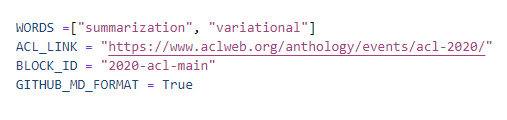
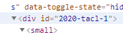
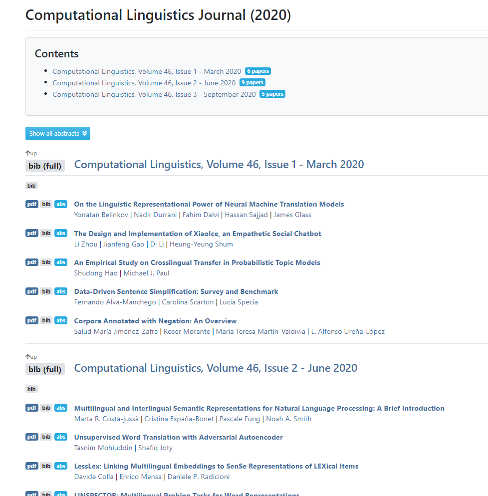
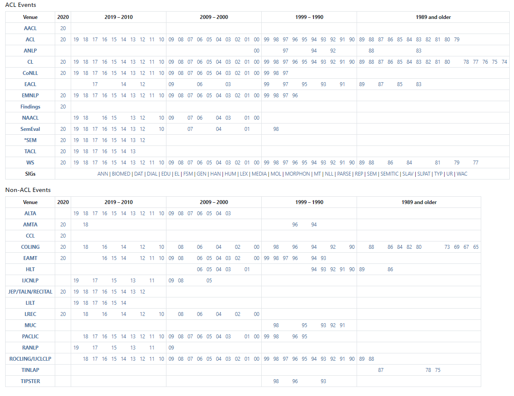

# Literature Review Helper 

<a>

</a>


```bash
pip install -r requirements.txt
python run.py
```

```bash
Output : Papername / PaperLink paired txt file.
```


## 

What you have to set in **run.py**



* **WORDS** : the key words that you want to catch. The program will select a paper if it has at least one of the key words. (not interaction it's union)
* **ACL_LINK** : there are many acl events and non-acl events. you have choose which one and the year. 
* **BLOCK_ID** : one conference composed of many blocks. for example the below picuture of CLJ has 2 blocks. You have to find it by yourself by insepcting the html (Ctrl+Shift + I for chrome)
<p align=center>

</p>
* GITHUB_MD_FORMAT : It is just for writing format. Use it when you want a github markdown foarmat. 

something like this [Provable Fast Greedy Compressive Summarization with Any Monotone Submodular Function](https://www.aclweb.org/anthology/N18-1157/)


|Block Examples|
|---|
||


## ⚠️⚠️ Waring ⚠️⚠️ 

If the chrome version doesn't match. You may have error. Download Chrome 
driver [here](https://sites.google.com/a/chromium.org/chromedriver/downloads) when you have an error. 

---


# Supports 

ACL Events or Non-ACL Events in [ACL Anthology](https://www.aclweb.org/anthology/)



